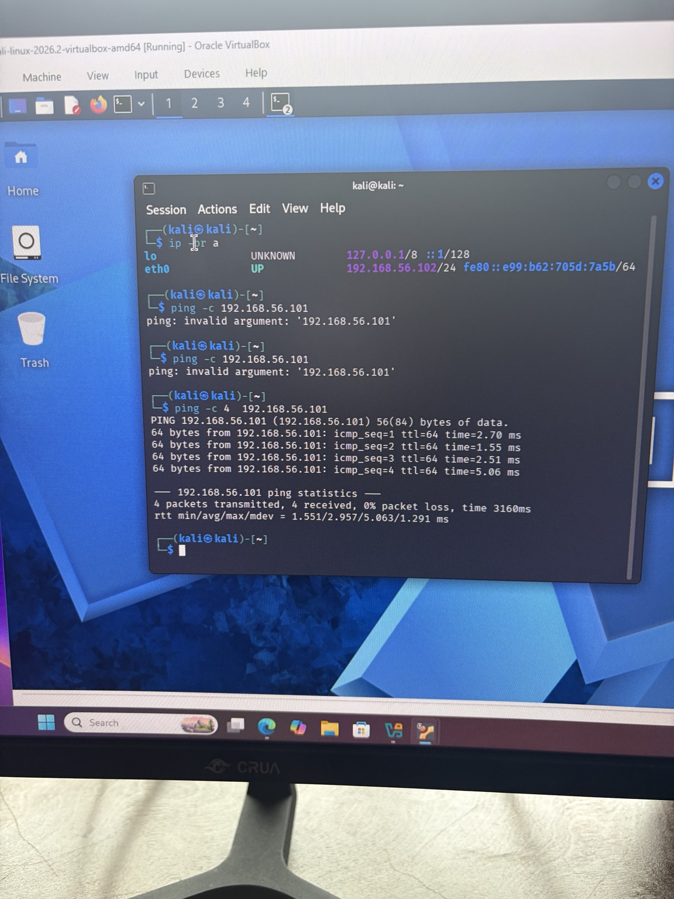
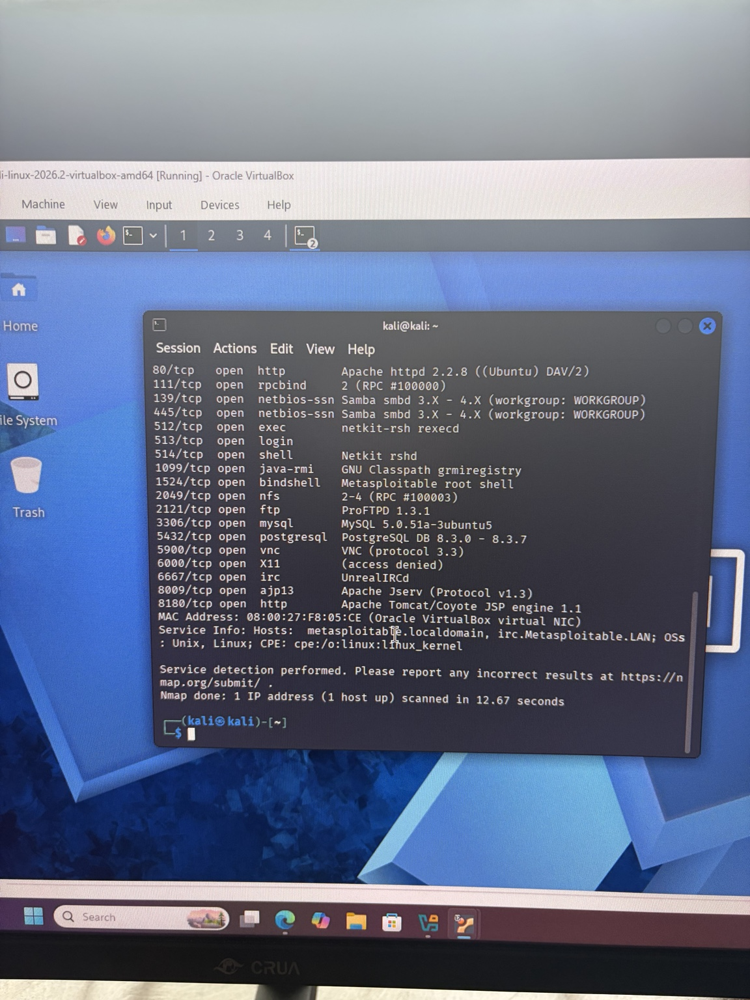
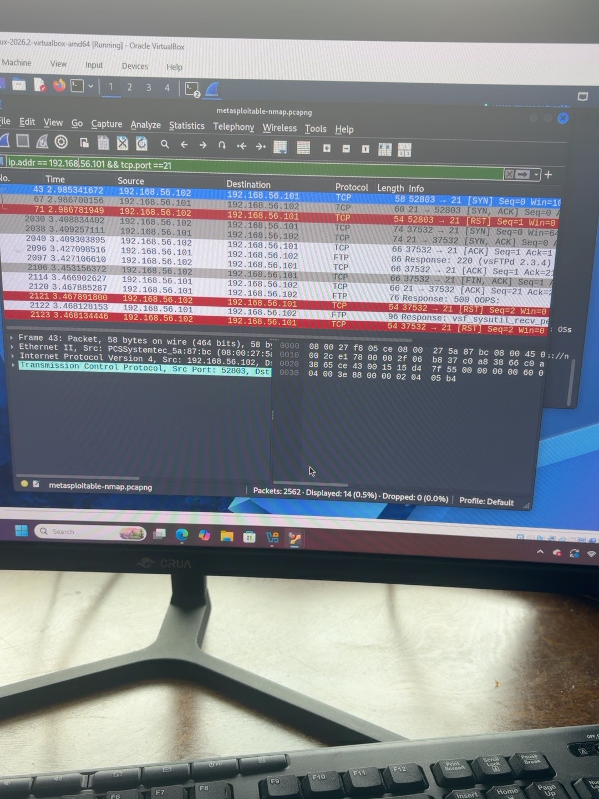
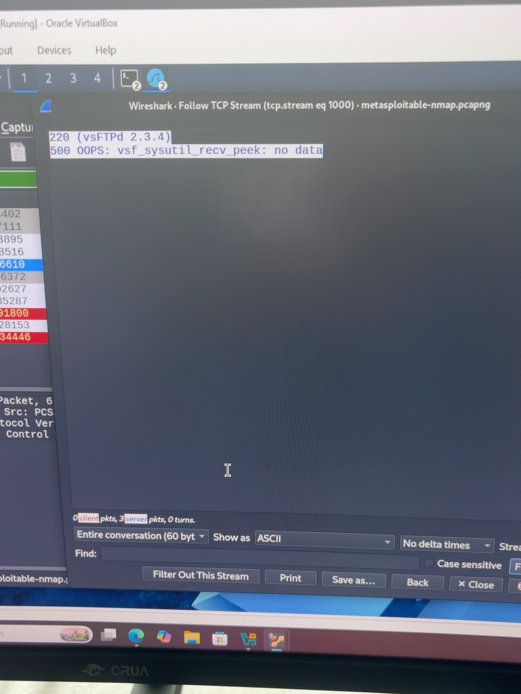

# Cybersecurity Home Lab: Kali Linux and Metasploitable 2

## Overview
I built a cybersecurity home lab to apply concepts from my CompTIA A+ and Network+ studies. I configured virtual machines, troubleshot setup issues, identified network services, analyzed packets, and reviewed Windows host security.

## Tools Used
- Oracle VirtualBox
- Kali Linux
- Metasploitable 2
- Nmap
- Wireshark
- Windows Security and BitLocker

## Network Setup
Both virtual machines used the same VirtualBox host-only network, allowing communication between the VMs and the host without directly connecting the target to an external network.

| Machine | Role | IP Address |
| --- | --- | --- |
| Kali Linux | Scanning and packet analysis | 192.168.56.102 |
| Metasploitable 2 | Intentionally vulnerable target | 192.168.56.101 |

## Setup and Troubleshooting
- Replaced an initially attached blank virtual disk with the downloaded Metasploitable.vmdk.
- Changed the Metasploitable guest profile to Ubuntu (32-bit), reduced memory to 1 GB, and disabled UEFI.
- Addressed a kernel boot error by enabling PAE/NX.
- Successfully booted Metasploitable and logged in.

## Connectivity Verification
On Metasploitable, I used `ifconfig` to identify its network address.

On Kali, I ran:

    ip -br a

This displays a brief summary of network interfaces, their status, and assigned IP addresses.

I then tested connectivity:

    ping -c 4 192.168.56.101

The `-c 4` option sends four requests and then stops. All four replies were received, with 0% packet loss.

An earlier attempt failed because I omitted the number after `-c`. Correcting the syntax resolved the error.

## Nmap Service Discovery
I ran:

    nmap -sV 192.168.56.101 -oN metasploitable-scan.txt

- `-sV` probes open ports to identify services and versions.
- `-oN` saves the results in a readable text file.

The scan identified 23 open TCP ports among the default 1,000 scanned.

Selected findings included:

| Port | Service | Reported Software |
| --- | --- | --- |
| 21 | FTP | vsftpd 2.3.4 |
| 22 | SSH | OpenSSH 4.7p1 |
| 23 | Telnet | Linux telnetd |
| 80 | HTTP | Apache 2.2.8 |
| 139, 445 | SMB | Samba |
| 3306 | MySQL | MySQL 5.0.51a |

These results identify exposed services. They do not, by themselves, confirm that a vulnerability is exploitable.

## Wireshark Traffic Analysis
I captured traffic on Kali's eth0 interface while repeating the Nmap scan and saved it as:

    metasploitable-nmap.pcapng

The capture contained 2,562 packets, with no reported capture drops.

To focus on FTP traffic involving the target, I applied:

    ip.addr == 192.168.56.101 && tcp.port == 21

An initial IP address typo caused the filter to display no packets. Correcting the address displayed 14 matching packets.

I examined TCP connection flags and used Follow TCP Stream to view the FTP server's readable responses:

    220 (vsFTPd 2.3.4)
    500 OOPS: vsf_sysutil_recv_peek: no data

The FTP greeting corroborated the version reported by Nmap. The error response did not establish successful exploitation.

## Windows Host Security Review
- Verified Windows Firewall was enabled for domain, private, and public profiles.
- Checked Windows Update status.
- Verified Secure Boot was enabled.
- Enabled BitLocker on the C: drive; encryption was in progress at the last recorded check.

These checks focused on the Windows host. Metasploitable remained intentionally vulnerable for lab practice.

## Skills Practiced
- Virtual machine configuration
- Linux command-line use
- IPv4 addressing and connectivity testing
- Network troubleshooting
- Port and service discovery
- Packet capture and TCP stream analysis
- Host security configuration
- Technical documentation

## Outcome
I successfully established communication between the virtual machines, documented exposed services, and compared Nmap findings with captured network traffic.

All scanning was directed at my own lab target. This project covered setup, service discovery, traffic analysis, and host security review; exploitation was not performed.

## Lab Evidence

### Connectivity Test
Four ping replies with 0% packet loss confirmed connectivity from Kali to Metasploitable.

### Nmap Service Discovery
The scan identified exposed TCP services and reported software versions.

### Wireshark FTP Traffic
Filtering for the target IP and TCP port 21 displayed FTP traffic and connection flags.

### Follow TCP Stream
The readable FTP greeting showed vsFTPd 2.3.4, corroborating Nmap's reported version.

